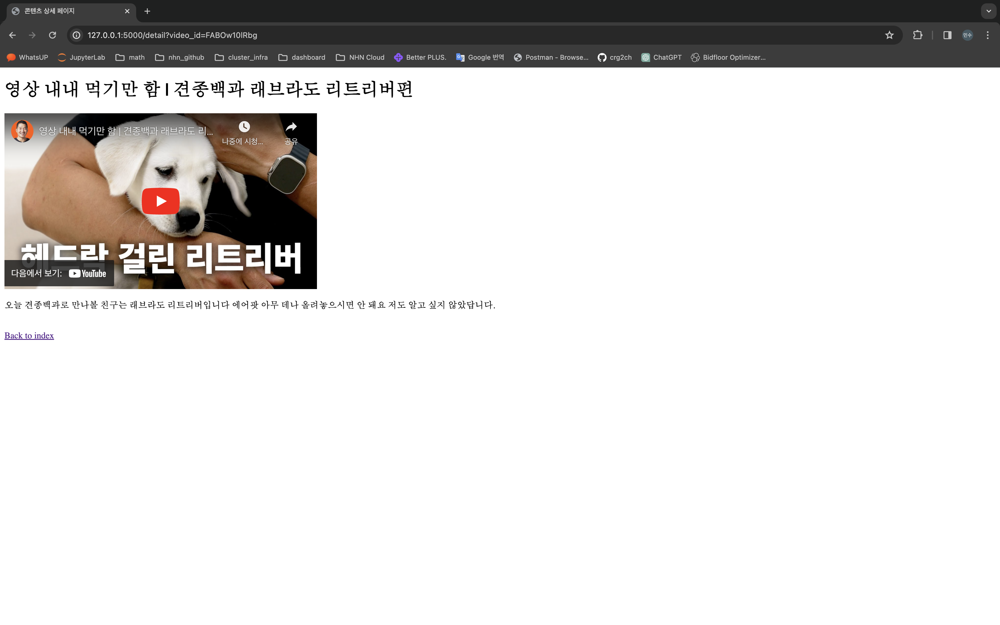
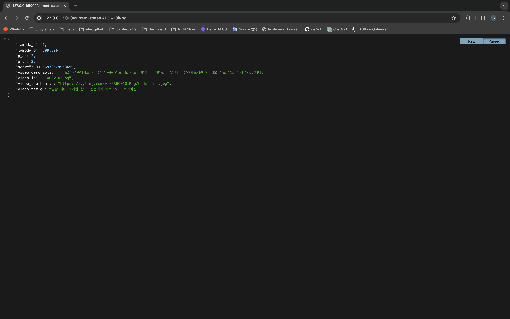

# 콘텐츠 추천 시스템
* 콘텐츠 추천 시스템 데모를 구현하였습니다.
    * https://bayesian-web.fly.dev/
* 데이터 수집, 모델링, 구현, 배포 등 추천 시스템에 필요한 전 과정을 빠르게 수행하였습니다.
* 콘텐츠는 YouTube 영상을 사용하였습니다. 수익을 목적으로 하지 않습니다.
* 콘텐츠 클릭률 x 콘텐츠 이용 시간의 기댓값이 높을 수록 상위에 노출 되도록 구현하였습니다.
* 베이지안 확률을 사용해서 콘텐츠 랭킹 스코어를 계산하였습니다.

<br>

## 필수 라이브러리 설치
* 다음 명령어로 필수 라이브러리를 설치해주세요.

```console
$ pip install -r requirements.txt
```

<br>

## 데이터 수집
* 데이터 수집은 [scraping-using-youtube-api.md](src/scraper/scraping-using-youtube-api.md) 문서를 참고해주세요.
* src/scraper/.env 파일에 youtube api 키를 입력하세요.
* 다음 명령어를 실행하면 제가 설정한 샘플 데이터가 자동으로 수집됩니다.

```console
$ python src/scraper/youtube_data_fetcher.py
```

* 수집된 데이터는 `src/data/youtube_data.tsv` 파일로 저장됩니다.
* youtube api를 사용하여 각 영상 별 다음과 같은 데이터를 수집하였습니다.
```text
video_id, video_title, video_description, video_thumbnail
```
* 이제 오프라인에서 서버를 실행할 수 있습니다.

<br>

## flask 서버 실행
* 다음 명령어로 flask 서버를 실행할 수 있습니다.

```console
$ python src/server.py
```

* 서버를 실행하고 메인 페이지('/')에 접속하면 일부 항목들의 콘텐츠의 썸네일이 노출됩니다.
    * `http://127.0.0.1:5000/`


* 스크롤을 하단으로 내리면 항목들의 썸네일이 추가로 노출됩니다.
* 썸네일을 클릭하면 콘텐츠 상세 페이지('/detail')로 이동합니다.
    * 상세페이지의 url에서 video_id 를 확인할 수 있습니다.
    * `http://127.0.0.1:5000/detail?video_id=FABOw10lRbg`
* 지금은 상세 페이지에 단순히 iframe 으로 youtube 영상만 올려두었지만, 콘텐츠 상세 페이지는 사용자의 이용시간이 길어지도록 다채롭게 꾸밀 수록 좋습니다.



* 콘텐츠들은 각자 추천 시스템에 활용되는 파라미터를 갖고 있습니다.
* 파라미터는 '/current-state/{video_id}' 에서 확인 가능합니다.
    * 콘텐츠 하나에 대한 파라미터
        * `http://127.0.0.1:5000/current-state/{video_id}`
    * 모든 콘텐츠에 대한 파라미터
        * `http://127.0.0.1:5000/current-state/all`



* 웹 페이지 위와 같이 세 부분으로 구성됩니다. 
    * 메인 페이지
    * 콘텐츠 상세 페이지
    * 콘텐츠 파라미터 확인 url

* 웹서버의 소스코드는 `src/web` 디렉토리를 확인해주세요.
* 이제 추천 시스템의 모델링 부분을 설명하겠습니다.

<br>

## 추천 시스템 모델링
* 사용자의 콘텐츠 이용시간을 최대화하는 것을 목적으로 하였습니다.
* 콘텐츠 이용시간은 썸네일 클릭 이후 콘텐츠 상세페이지를 이용하는 시간의 합으로 정의하였습니다.
* 따라서 콘텐츠는 두 가지 측면에서 사용자의 참여를 유도해야 합니다.
    * 사용자가 콘텐츠 썸네일을 클릭하도록 유도
    * 사용자가 콘텐츠 상세 페이지에 오래 머물도록 유도

<br>

### 베이지안 확률 모델링
* 어떤 콘텐츠의 이용 시간을 $X$ 로 정의하면, $X$를 다음과 같이 분해할 수 있습니다.

$$X = Y\cdot Z$$

$Y=\begin{cases}1&&\text{썸네일 클릭}\\ 0&&\text{썸네일 클릭 안 함}\end{cases}$

$Z$: 상세 페이지에 들어왔다는 조건에서, 상세 페이지 이용 시간

($Y$와 $Z$는 독립이라고 가정)

* $Y$는 베르누이 분포로 정의하고, $Z$는 지수분포로 정의
* 베르누이 분포의 모수 $p$와 지수분포의 모수 $\lambda$는 모두 베이지안 확률로 정의

$$Y\sim Bernoulli(p),\quad p\sim B(\alpha_p,\beta_p)$$

$$Z\sim\exp(\lambda),\quad \lambda\sim\Gamma(\alpha_\lambda,\beta_\lambda)$$

<br>

### 콘텐츠 노출 순서 (톰슨 샘플링)
* 메인 페이지에 진입할 때마다 각 콘텐츠 별로 $p$와 $\lambda$를 사전분포에서 샘플링
* 샘플링된 $p$와 $\lambda$로부터 $X$의 기댓값을 계산
$$\mathbb{E}(X)=\mathbb{E}(Y)\cdot\mathbb{E}(Z)=p\cdot\frac1\lambda$$
* $X$의 기댓값 순서대로 콘텐츠 노출

<br>

### 사전 분포 업데이트
* 노출된 콘텐츠는 다음과 같이 파라미터가 업데이트 됩니다.
* 클릭 이벤트가 발생했을 경우, $p$의 사전분포 업데이트
    * 썸네일을 클릭한 콘텐츠:
        * $\alpha_p\leftarrow\alpha_p+1$
    * 썸네일을 클릭하지 않은 콘텐츠:
        * $\beta_p\leftarrow\beta_p+1$
* 상세페이지로 이동하였을 때, $\lambda$의 사전분포는 다음과 같이 업데이트 된다.
    * $\alpha\leftarrow\alpha+1$
    * $\beta\leftarrow\beta+\text{상세 페이지 이용 시간}$

* 사전분포의 업데이트는 [Conjugate Prior](https://en.wikipedia.org/wiki/Conjugate_prior) 페이지 참고

<br>

### (참고) MAB 테스트
* [MAB_AB_Test.md](src/bayesian-demo/MAB_AB_Test.md) 문서는 Thompson Sampling을 활용한 A/B 테스트에 관해 서술하고 있습니다.
* 문제의 설정은 단일 콘텐츠(광고)를 노출하는 것으로 추천 시스템의 설정과 조금 다르지만, 랜덤변수를 분해하고, 베이지안 확률로 모델링하고, 톰슨 샘플링을 사용했다는 점에서 해당 문서는 본문의 추천 시스템과 큰 틀을 같이 합니다.
* MAB_AB_Test에서 시뮬레이션을 하였을 때 다음과 같은 긍정적인 결과를 얻을 수 있었습니다.
    * 시청 시간이 높은 콘텐츠(광고) 노출 횟수가 시청 시간이 낮은 콘텐츠보다 압도적으로 많았다.
    * 클릭률의 모수 $p$와 시청시간의 모수 $\lambda$의 베이지안 확률 분포가 실제값과 거의 일치하도록 학습되었다.
* 이를 미루어 보면, 본문의 추천 시스템도 콘텐츠 이용 시간이 높은 항목을 많이 노출시키고, 베이지안 확률의 모수도 잘 학습시킬 것이라고 유추할 수 있을 것입니다.

<br>

## 워크플로우
* 사용자가 메인 페이지('/')에 접속합니다.
* 메인 페이지 접속하면 서버에서 콘텐츠 노출 스코어를 생성하고, 콘텐츠 썸네일을 노출합니다.
    * 톰슨 샘플링과 같이, 각 콘텐츠의 파라미터 $p$와 $\lambda$를 사전분포에서 샘플링합니다.
    * 콘텐츠 이용 시간의 기댓값 $\mathbb{E}(X)=p\cdot\frac1\lambda$ 을 노출 스코어로 저장합니다.
    * 메인 페이지에서 노출 스코어의 내림 차순으로 콘텐츠 썸네일 중 일부를 노출합니다.
* 스크롤을 하단으로 내리면 썸네일들이 추가로 노출됩니다.
* 사용자가 썸네일 중 하나를 클릭하면 콘텐츠 상세 페이지('/detail')로 이동합니다.
    * 이 때 노출되었던 콘텐츠 id가 쿠키로 서버에 전송됩니다.
    * 서버에서 노출되었던 콘텐츠의 클릭 파라미터 $p$의 사전분포를 업데이트 합니다.
    * 클릭한 콘텐츠: $\alpha_p\leftarrow\alpha_p+1$
    * 노출만 된 콘텐츠: $\beta_p\leftarrow\beta_p+1$
    * 이후 콘텐츠 id를 담고 있는 쿠키를 지워줍니다.
* 콘텐츠 상세 페이지에 진입한 시점을 저장합니다.
* 콘텐츠 상세 페이지를 이탈하는 이벤트가 발생면 콘텐츠 이용 시간과 관련한 파라미터 $\lambda$를 업데이트 합니다.
    * 상세 페이지 이탈의 종류는 하이퍼링크 클릭, 뒤로가기, 브라우저 닫기, 새로 고침 등이 포함됩니다.
    * 상세 페이지 이용 시간 = 상세 페이지 이탈 시점 - 상세 페이지 진입 시점
    * $\lambda$의 파라미터 업데이트
        * $\alpha_\lambda\leftarrow\alpha_\lambda+1$
        * $\beta_\lambda\leftarrow\beta_\lambda+\text{콘텐츠 이용 시간}$
* 이제 메인 페이지에 접속하면, 업데이트 된 사전분포로 생성된 노출 스코어에 의해 썸네일이 노출됩니다.
* 콘텐츠 및 파라미터와 관련된 현황은 '/current-state/{video_id}'  또는 '/current-state/all' 을 입력하여 확인할 수 있습니다.

<br>

## Fly를 이용한 웹서버 배포
* Fly 는 웹서버를 편리하게 배포할 수 있게 해주는 서비스입니다. ([공식문서](https://fly.io/docs/))
* Fly를 이용한 배포 단계는 다음과 같습니다.
* 먼저 `brew` 를 통해 `flyctl`을 설치합니다.

```console
$ brew install flyctl
```

* 그리고 fly.io에 접속하여 회원가입과 신용카드 등록을 합니다.
* 터미널에 다음 명령어를 입력하여 계정에 로그인을 합니다. (웹 브라우저가 열리고, 거기에서 로그인)

```console
$ flyctl auth login
```

* 다음 명령어를 실행하여 배포를 위한 준비 작업을 합니다.
    * 현재 프로젝트는 이미 실행하였기 때문에 이 작업은 생략 가능합니다

```console
$ fly launch
```

* Procfile 파일을 적절하게 수정해줍니다.

```Procfile
web: gunicorn --pythonpath src server:app
```

* 서버 실행 파일이 `src` 경로에 있고, 실행파일 이름은 `server.py` 입니다. 그리고 `server.py` 에서 서버 객체의 변수명은 `app` 입니다.

* `fly.toml` 파일에서 배포를 위한 설정들을 확인합니다.

```toml
# fly.toml app configuration file generated for bayesian-web on 2024-02-23T03:44:46+09:00
#
# See https://fly.io/docs/reference/configuration/ for information about how to use this file.
#

app = 'bayesian-web'
primary_region = 'nrt'

[build]
  builder = 'paketobuildpacks/builder:base'

[env]
  PORT = '8080'

[http_service]
  internal_port = 8080
  force_https = true
  auto_stop_machines = false
  auto_start_machines = false
  min_machines_running = 0
  processes = ['app']

[[vm]]
  memory = '1gb'
  cpu_kind = 'shared'
  cpus = 1
```

* app의 이름은 'bayesian-web' 입니다. `auto_stop_machines`과 `auto_start_machines`는 모두 true로 하거나 모두 false로 하는 것을 권장합니다.
* 이제 배포를 위한 모든 단계가 완료되었습니다.
* 다음 명령어를 실행하여 배포하세요.

```console
$ fly deploy
```

* 이 작업은 몇 분 정도 소요됩니다.

* 이제 다음 url에 접속하면 배포된 서비스를 접할 수 있습니다.

```text
bayesian-web.fly.dev/
```

* 다음 url에서 로그를 모니터링할 수 있습니다.

```text
https://fly.io/apps/bayesian-web/monitoring
```

<br>

# Reference
* https://developers.google.com/youtube/v3?hl=ko
* https://en.wikipedia.org/wiki/Conjugate_prior
* https://towardsdatascience.com/beyond-a-b-testing-multi-armed-bandit-experiments-1493f709f804
* https://fly.io/docs/
* https://www.youtube.com/watch?v=9ZYB_bFRW8A