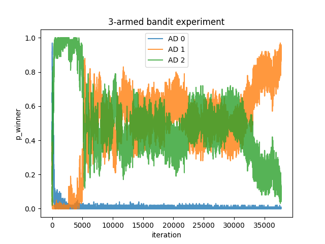

# Multi-armed Bandit 을 사용한 A/B 테스트
## A/B 테스트의 특성 및 단점
* A/B 테스트는 두 가지 이상의 대안을 비교하는 가장 일반적인 실험 디자인이다
* A/B 테스트는 각 대안의 유의성을 높은 신뢰수준으로 비교할 수 있는 장점이 있다.
* 그러나 A/B 테스트는 자원을 효율적으로 사용하지 못 하는 단점이 있다.
    * A와 B를 5:5 비중으로 사용하기로 디자인 된 A/B 테스트의 경우
    * 실제로는 A가 B보다 우수하고, 실험 중에 이를 유추할 수 있다고 해보자
    * 최적의 결과를 얻으려면 A의 비중을 늘리고 B의 비중을 줄여야 한다.
    * 그러나 A/B 테스트는 전체 실험 기간동안 A와 B의 비중을 균일하게 유지한다.
    * A 대신에 B를 사용하는 것은 (기회)비용을 만드는 행위
    * 이처럼 A/B 테스트는 자원을 낭비할 수 있는 방법론이다

## MAB 테스트
* MAB 테스트는 A/B 테스트의 일부 단점을 극복하기 위해 개발된 방법론
* 여러 대안을 동시에 평가하면서 시간이 지남에 따라 최적의 대안의 비중을 늘려간다
* 시간이 지남에 따라 최적의 대안을 식별함으로써 자원 낭비를 최소화한다

일반적으로 유의성이 중요한 경우 A/B 테스트를 사용하고, 자원 사용의 최적화가 중요한 경우 A/B 테스트 대신에 MAB 테스트를 사용할 수 있다. 산업에서는 주로 유의성 보다 자원 사용의 최적화가 중요한 경우가 많으므로, MAB 테스트의 활용도가 높아질 수 있다.

<br>

# Thompson Sampling을 활용한 MAB 테스트
## 동영상 광고 예시
클릭을 해야 재생되는 동영상 광고가 있다고 해보자. 광고 시청 시간이 최대가 되게 하려면 어떻게 해야 할까?

동영상 광고가 노출되었을 때, 광고 시청 시간은 다음과 같다.

$$\text{광고 시청 시간} = \begin{cases}0&&\text{클릭 안 한 경우}\\ 
\text{시청 시간}&&\text{클릭한 경우}\end{cases}$$

광고 시청 시간을 두 개의 랜덤변수의 곱으로 표현할 수 있다.
$$X=Y\cdot Z$$

$X:\text{광고 시청 시간}$

$`Y=\begin{cases}0&&\text{클릭 안 한 경우}\\1&&\text{클릭한 경우}\end{cases}`$

$Z:\text{클릭했다는 조건에서 광고 시청시간}$

<br>

변수 $X$의 기댓값이 높은 광고의 비중을 늘리면 광고 시청 시간이 최대가 될 것.

<br>

## 베이지안 확률
랜덤변수 $X,Y,Z$를 베이지안 확률을 따른다고 가정하자. 베이지안 확률은 불확실성을 확률적으로 모델링하고, 관찰된 데이터를 바탕으로 확률을 갱신하는 방법론이다. 랜덤변수의 모수를 베이지안 확률로 정의할 수 있다.

랜덤변수 $Y$와 $Z$를 다음과 같이 모델링하자.

$$
\displaylines{Y\sim Bernoulli(p),\quad p\sim B(\alpha_p,\beta_p)\\ 
Z\sim\exp(\lambda),\quad \lambda\sim\Gamma(\alpha_\lambda,\beta_\lambda)}
$$

Bayes' rule 에 의해 사전분포는 관찰된 데이터를 바탕으로 다음과 같이 업데이트 된다.

$$\text{사후분포} \propto Likelihood \cdot 사전분포$$

<br>

### $p$ 확률 업데이트
Bayes' rule을 $p$에 적용하면,

$$\begin{align}\Pr(p|y_1,...,y_n,\alpha_p,\beta_p)\propto \Pr(y_1,...,y_n|p,\alpha_p,\beta_p)\cdot\Pr(p|\alpha_p,\beta_p) \\
\propto p^{\sum\limits_{i=1}^ny_i}(1-p)^{\sum\limits_{i=1}^n(1-y_i)}\cdot p^{\alpha_p}(1-p)^{\beta_p}\\
=p^{\alpha_p+\sum\limits_{i=1}^ny_i}(1-p)^{\beta_p+\sum\limits_{i=1}^n(1-y_i)}\\
\propto B(\alpha_p+\sum\limits_{i=1}^ny_i, \beta_p+\sum\limits_{i=1}^n(1-y_i))\end{align}$$

따라서 $p$의 확률은 베타분포가 유지되고, 베타분포의 모수만 다음과 같이 업데이트 된다.

$\alpha_p\leftarrow\alpha_p+\sum\limits_{i=1}^ny_i$

$\beta_p\leftarrow\beta_p+\sum\limits_{i=1}^n(1-y_i)$

### $\lambda$ 확률 업데이트
Bayes' rule을 $\lambda$에 적용하면,

$$\begin{align} \Pr(\lambda|z_1,...,z_m,\alpha_\lambda,\beta_\lambda) \propto\Pr(z_1,...,z_m|\lambda,\alpha_\lambda,\beta_\lambda)\cdot\Pr(\lambda|\alpha_\lambda,\beta_\lambda)\\
\propto \lambda^me^{-\lambda\sum\limits_{i=1}^mz_i}\lambda^{\alpha_\lambda-1}e^{-\beta_\lambda\lambda}\\
\propto\lambda^{\alpha_\lambda+m-1}e^{-(\beta_\lambda+\sum\limits_{i=1}^mz_i)\lambda}\\
\propto\Gamma(\alpha_\lambda+m, \beta_\lambda+\sum\limits_{i=1}^mz_i)\end{align}$$

마찬가지로 $\lambda$의 확률은 감마분포가 유지되고, 감마분포의 모수만 다음과 같이 업데이트 된다.

$\alpha_\lambda\leftarrow\alpha_\lambda+m$

$\beta_\lambda\leftarrow\beta_\lambda+\sum\limits_{i=1}^mz_i$

<br>

## Multi-Armed Bandit
선택할 광고를 arm 으로 설정하여 multi-armd bandit 을 모델링할 수 있다. reward 는 광고 시청 시간 ($X=Y\cdot Z$) 이다. arm에 대한 베이지안 확률을 구현하면 다음과 같다.

```python
class Prior_of_p:
   def __init__(self, a, b):
       self.a = a
       self.b = b
  
   def click(self,):
       self.a += 1

   def no_click(self,):
       self.b += 1
  
   def draw_p(self,):
       return np.random.beta(a=self.a, b=self.b)

class Prior_of_lambda:
   def __init__(self, a, b):
       self.a = a
       self.b = b
  
   def update_lambda(self, t):
       self.a += 1
       self.b += t
  
   def draw_lambda(self,):
       return np.random.gamma(shape=self.a, scale=1/self.b)

class Arm:
   def __init__(self, id, p_a=1, p_b=1, lambda_a=1, lambda_b=1):
       self.id = id
       self.prior_of_p = Prior_of_p(a=p_a, b=p_b)
       self.prior_of_lambda = Prior_of_lambda(a=lambda_a, b=lambda_b)
  
   def p_a(self,):
       return self.prior_of_p.a
  
   def p_b(self,):
       return self.prior_of_p.b
  
   def lambda_a(self,):
       return self.prior_of_lambda.a
  
   def lambda_b(self,):
       return self.prior_of_lambda.b
  
   def click(self,):
       self.prior_of_p.click()
  
   def no_click(self,):
       self.prior_of_p.no_click()
  
   def draw_p(self,):
       return self.prior_of_p.draw_p()
  
   def update_lambda(self, t):
       self.prior_of_lambda.update_lambda(t)
  
   def draw_lambda(self,):
       return self.prior_of_lambda.draw_lambda()
  
   def predict_reward(self,):
       p = self.draw_p()
       lambda_ = self.draw_lambda()
       return p / lambda_
```

<br>

## Thompson Sampling
톰슨 샘플링은 베이지안 확률을 기반으로 하는 Multi-Armed Banit 알고리즘이다. 톰슨 샘플링으로 광고를 내보낸다면, 광고 시청 시간($X$)이 긴 광고의 노출 비중을 높일 수 있다.

다음은 톰슨 샘플링을 구현한 코드이다.

```python
def thompson_sampling(arms):
   sample = [arm.predict_reward() for arm in arms]
   idx = np.argmax(sample)
   return idx
```

<br>

## Monte Carlo simulation
광고의 우위가 확실해지면 MAB 테스트를 종료할 것이다. 성능이 우수한 광고를 챔피온이라고 하자. 다른 광고가 챔피온의 성능을 개선할 가능성이 거의 없다고 판단되면 MAB 테스트를 종료한다.

챔피온의 성능을 개선할 가능성을 추정하기 위해서 몬테 카를로 시뮬레이션을 한다.
```python
def monte_carlo_simulation(arms, draw=100):
   k = len(arms)
   p_as = [arm.p_a() for arm in arms]
   p_bs = [arm.p_b() for arm in arms]

   lambda_as = np.array([arm.lambda_a() for arm in arms])
   lambda_bs = np.array([arm.lambda_b() for arm in arms])

   mc_p = np.random.beta(p_as, p_bs, size=(draw, k))
   mc_lambda = np.random.gamma(lambda_as, 1/lambda_bs, size=(draw, k))
   mc = mc_p / mc_lambda

   counts = [0 for _ in range(k)]
   winner_idx = mc.argmax(axis=1)
   for idx in winner_idx:
       counts[idx] += 1
  
   p_winner = [count / draw for count in counts]
   return mc, p_winner
```

<br>

## Termination
몬테 카를로 시뮬레이션 결과로부터 실험을 종료할지 결정한다. 종료 조건으로 "value remaining in experiment" 라는 개념을 사용하였다. [다음 링크 참조](https://analytics.googleblog.com/2013/01/multi-armed-bandit-experiments.html)

챔피온을 1% 이상 개선할 가능성이 $\alpha$% 보다 작으면 실험을 종료한다.

```python
def should_terminate(p_winner, mc, alpha=0.05):
   champion = np.argmax(p_winner)
   values_remaing = (mc.max(axis=1) - mc[:, champion]) / mc[:, champion]
   pctile = np.percentile(values_remaing, q=100 * (1 - alpha))
   return pctile < 0.01
```

<br>

## Simulation
MAB 테스트를 시뮬레이션한 코드는 다음과 같다.

```python
def k_arm_bandit(ctrs, lambdas, alpha=0.05, burn_in=1000, max_iter=100_000, draw=100, silent=False):
   n_arms = len(ctrs)
   arms = [Arm(id=i) for i in range(n_arms)]
   history_p = [[] for _ in range(n_arms)]

   for i in range(max_iter):
       idx = thompson_sampling(arms)
       arm, ctr, lambda_ = arms[idx], ctrs[idx], lambdas[idx]

       if np.random.random() < ctr:
           arm.click()
           t = np.random.exponential(scale=1/lambda_)
           arm.update_lambda(t)
       else:
           arm.no_click()
      
       mc, p_winner = monte_carlo_simulation(arms, draw)
       for j, p in enumerate(p_winner):
           history_p[j].append(p)
      
       predicted_rewards = [arm.predict_reward() for arm in arms]

       if i >= burn_in and should_terminate(p_winner, mc, alpha):
           if not silent:
               print("Terminated at iteration %i"%(i+1))
           break
  
   traffic = [arm.p_a() + arm.p_b() - 2 for arm in arms]
   return predicted_rewards, history_p, traffic, arms
```

<br>

### 시뮬레이션 결과
광고 3개가 있다고 가정하고 실험한 결과이다.

|           |광고0|광고1|광고2|
|-----------|----|----|----|
|실제 $p$ (ctr)|0.3|0.38|0.41
|실제 $\lambda$ |0.05|0.05|0.0556|
|평균 시청 시간(실제)|6|7.6|7.38|
|예측 $p$ |0.2509|0.3826|0.4124|
|예측 $\lambda$ | 0.0552|0.0503|0.0557|
|평균 시청 시간(예측)|4.543|7.607|7.408|
|시행 횟수|285|18700|18772|

* 실제 평균 시청 시간은 광고1이 가장 좋다.
* 광고1과 광고2는 값이 비슷하고, 광고0은 이보다 떨어진다.
* 실험 이후에 $p,\lambda$, 평균 시청 시간의 예측값이 모두 잘 맞아 떨어졌다.
* 시행 횟수는, 평균 시청 시간이 큰 광고의 비중이 컸다.
<br>



* 그림을 보면, 시행 초기에는 챔피온을 광고2로 잘못 인식하였지만, 시행을 지속하면서 광고1이 챔피온으로 올라왔고, 이후 실험이 종료되었다.

# Reference
* https://towardsdatascience.com/beyond-a-b-testing-multi-armed-bandit-experiments-1493f709f804
* https://en.wikipedia.org/wiki/Conjugate_prior
* https://en.wikipedia.org/wiki/Bayesian_inference
