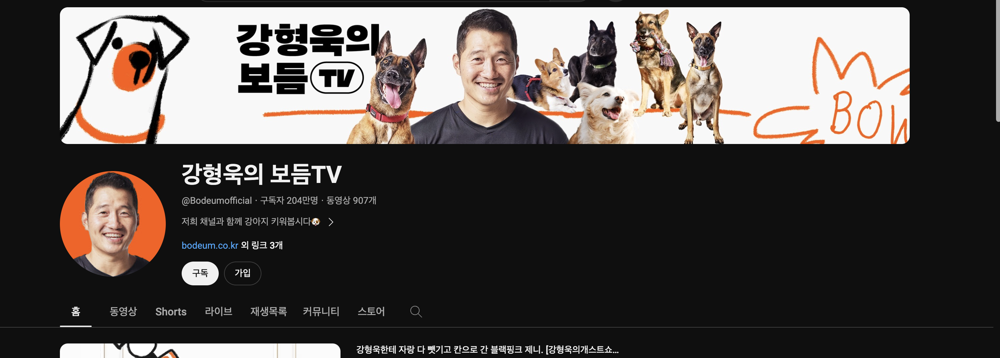
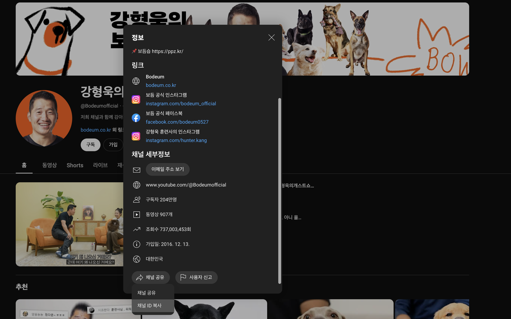

# YouTube API 를 활용한 콘텐츠 스크래핑
YouTube API 를 사용하여 콘텐츠를 스크래핑 하는 방법에 대한 설명입니다.

## 1. YouTube API 키 사용
### 1-1. API 키 발급
[공식 문서](https://developers.google.com/youtube/v3/getting-started?hl=ko)를 참고하여서 YouTube API Key를 발급받으세요.

<br>

### 1-2. .env 파일에 YouTube API 키 저장
현재 디렉토리에 있는 .env 파일에 다음과 같이 당신의 YouTube API 키를 등록해주세요.

```.env
# YOUR_YOUTUBE_API_KEY 부분을 실제 API Key로 수정
YOUTUBE_API_KEY=YOUR_YOUTUBE_API_KEY
```

<br>

## 2. 데이터 스크래핑
### 2-1. 스크래핑할 유튜브 채널의 id를 얻으세요 

채널 id를 얻는 방법은 youtube가 업데이트될 때마다 달라집니다. 참고할 사이트를 첨부합니다.
([참고 사이트](https://stackoverflow.com/questions/14366648/how-can-i-get-a-channel-id-from-youtube))

다음은 채널 id를 얻는 방법 중 하나입니다.

* 채널 이름 아래 채널 설명 페이지 클릭



* 하단에 `채널공유` 클릭, `채널 ID 복사` 클릭



<br>

다음은 위와 같은 방법으로 얻은 채널 ID 입니다.
```text
# 강형욱의 보듬TV
UCee1MvXr6E8qC_d2WEYTU5g
```

<br>

### 2-2. youtube_data_fetcher.py 실행

채널 id와 YouTube API 키를 사용하여서 채널에 있는 동영상 콘텐츠 메타 정보를 다운로드 받으세요. tsv 형식으로 저장됩니다.

* youtube_data_fetcher.py 실행
* args 값 지정 (옵션)
    * --file_path
        * 저장 경로
    * --channel_id
        * 채널 id
    * --maxResults
        * 스크래핑할 개수

다음은 명령어 예시입니다.

```console
$ python youtube_data_fetcher.py --file_path ../data/youtube_data.tsv --channel_id UCee1MvXr6E8qC_d2WEYTU5g --maxResults 100
```

`강형욱의 보듬TV` 채널의 콘텐츠 메타 정보 `100개`가 `../data/youtube_data.tsv` 파일에 저장됩니다.

<br>

# Reference
* https://developers.google.com/youtube/v3/getting-started?hl=ko
* https://stackoverflow.com/questions/14366648/how-can-i-get-a-channel-id-from-youtube